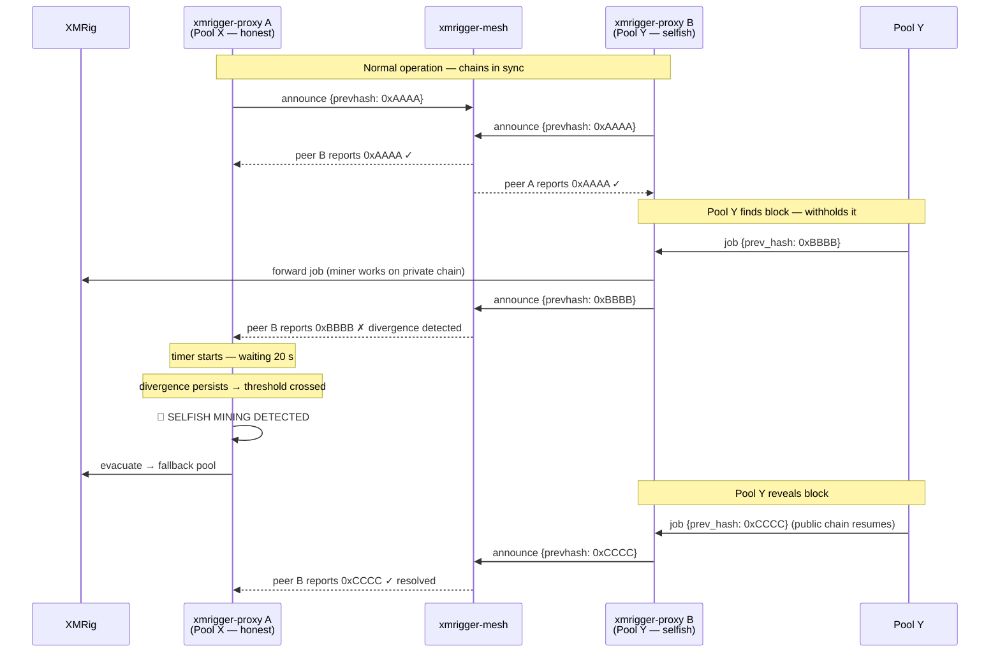
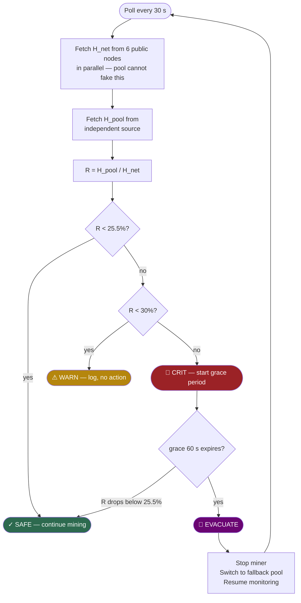
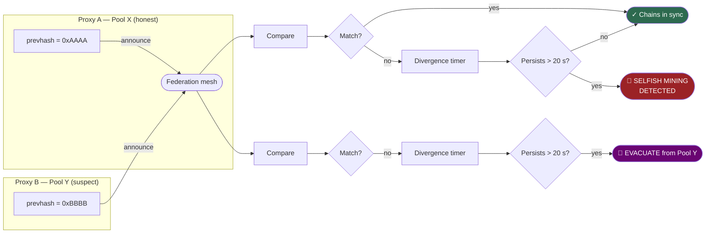

# xmrigger

Core detection library. Implements two guards: `HashrateMonitor` watches pool hashrate concentration and evacuates when a pool exceeds the threshold; `PrevhashMonitor` detects selfish mining by comparing prevhash values across federated proxies. Zero dependencies. Can be used standalone in any miner wrapper.

Part of the [xmrigger suite](https://github.com/xmrigger): `xmrigger` · `xmrigger-mesh` · `xmrigger-proxy`


[](LICENSE)
[](https://nodejs.org)

---

## The selfish mining problem — 

Between 2019 and 2024 the Monero research community debated whether selfish
mining could be detected and countered without modifying the protocol
([research-lab #136–#146](https://github.com/monero-project/research-lab/issues/136)).
The proposals that emerged — Detective Mining and its variants — required either
a Monero hard fork, active counter-block submission, or changes that full nodes
would reject. None reached production.

**The passive subset that actually works:**

A pool engaged in selfish mining must distribute Stratum jobs to its workers.
Every `mining.notify` carries
`prevhash` — the hash of the block being extended. A pool on a private fork
cannot hide this: it must hand the private chain tip to every miner it employs,
or those miners produce worthless work.

Any proxy sitting between a miner and a pool observes every prevhash in every
job. When two or more such proxies watch different pools and share prevhash
values across a lightweight federation mesh, a divergence immediately reveals
that one pool is building on a private chain.

**Zero protocol changes. Zero miner changes. Point XMRig at the proxy.**

---

## Detection in action



---

## Two threats, two guards

| Guard | Threat | Mechanism |
|-------|--------|-----------|
| `HashrateMonitor` | Pool accumulates >30% of network hashrate | Polls independent hashrate sources; evacuates on threshold breach |
| `PrevhashMonitor` | Pool withholds blocks (selfish mining) | Cross-pool prevhash comparison via federation mesh |

---

## How the proxy works

```
┌─────────────────────────────────────────────────────────────┐
│                        xmrigger                        │
│                                                             │
│  XMRig ──Stratum──▶ proxy ──Stratum──▶ pool                 │
│                        │                                    │
│               extract prevhash                              │
│               from every job                                │
│                        │                                    │
│                  federation mesh ◀──▶ other proxies         │
│                        │              (other pools)         │
│               compare prevhash                              │
│               values across pools                           │
│                        │                                    │
│              divergence persists?                           │
│              ──────────┴──────────                          │
│             yes                  no                         │
│              │                   │                          │
│         EVACUATE            continue                        │
│         to fallback                                         │
└─────────────────────────────────────────────────────────────┘
```

The miner's configuration does not change. The guard is transparent.

---

## Guard 1 — Hashrate Concentration

### How it works



### Data source trust hierarchy

```
  1. Third-party stats (miningpoolstats.stream, etc.)   ← independent
  2. Pool /pool/health (pool self-reports)               ← least trusted
```

Network hashrate is always fetched from six independent public Monero nodes —
never from the pool being monitored. A pool cannot suppress its own detection
by going silent.

### Federation acceleration

When several proxies share the same upstream pool, one detection triggers an
immediate poll on all peers — instead of waiting for their next cycle.

```
  t = 0 s   Pool X climbs to 32%

  ┌──────────┐        ┌──────────┐        ┌──────────┐
  │ Guard A  │        │ Guard B  │        │ Guard C  │
  │  32% !!  │        │  28%  ✓  │        │  27%  ✓  │
  │  [CRIT]  │        │ (30 s ago│        │ (30 s ago│
  └────┬─────┘        └────┬─────┘        └────┬─────┘
       │  guard-alert ────▶│  guard-alert ────▶│
       │                   │  pollNow()        │  pollNow()
       │                   │  → 32% [CRIT]     │  → 32% [CRIT]
       │                   │                   │
  EVACUATE → Pool B   EVACUATE → Pool B   EVACUATE → Pool C
```

**Sovereignty rule:** each guard verifies independently. A misconfigured peer
cannot force mass evacuations.

---

## Guard 2 — Selfish Mining Detection

### The key insight



### Why persistence matters

A brief mismatch is normal — block propagation takes 1–2 s. Requiring
divergence to persist for multiple poll cycles eliminates false positives
from network jitter.

### Detection scenarios

| Scenario | Detected |
|----------|----------|
| Pool mines privately (selfish mining) | ✓ prevhash differs from peers |
| Propagation delay | ✗ resolves within 1–2 polls |
| Pool stuck on stale tip | ✓ prevhash stops advancing |
| Unknown dark pool (no external miners) | ✗ no Stratum leakage possible |

### Compatibility with steganographic proxies

Proxies that carry additional payloads within the Stratum stream are fully
compatible. Those payloads travel miner → proxy and are intercepted there.
Prevhash extraction happens on the pool → proxy path. The two mechanisms
are orthogonal and do not interfere.

During the divergence window (before evacuation triggers), miners on the
suspect pool are contributing hashrate to the private fork. This is
unavoidable for any miner at that pool. The guard minimises this window to
`divergenceMs` and evacuates automatically.

### Network effect

Detection requires a federation of **≥ 2 proxies watching different pools**.
A single isolated proxy cannot compare prevhash values.

The protection scales with deployment: each additional proxy in the federation
increases observation coverage across pools. A pool attempting sustained
private-chain mining faces an increasingly larger set of independent
observers. Reaching the point where detection is impossible requires 100%
in-house hashrate — operationally difficult, and already detectable by Guard 1.

**This is the passive, protocol-transparent answer to the selfish mining
problem: zero Monero protocol changes, zero miner configuration, zero friction
for any miner already using a proxy.**

### Bootstrap

The list of Monero mining pools is public and not pool-controlled.
A fresh node uses it to find seed peers at startup without any prior
federation state.

Until the first peer from a different pool connects, the node operates in
**solo mode**: Guard 1 (hashrate concentration) is fully active;
Guard 2 (selfish mining) is dormant but armed.

As soon as one peer joins from a different pool, Guard 2 activates
automatically — no configuration change needed.

Once two or more nodes are connected, the mesh carries peer discovery
itself: new nodes learn about other proxies through the federation
without needing a central directory.

The first node in existence is therefore never unprotected — it has
Guard 1 from the start, and Guard 2 the moment a second independent
observer appears.

---

## Quick start

```bash
git clone https://github.com/xmrigger/xmrigger
cd xmrigger
npm install
node demo.js       # runs both guards, ~100 s, no config needed
```

---

## POC demos

### Combined (both guards)

```bash
node demo.js
# or:  npm run demo
```

Runs the hashrate guard demo (~50 s) then the prevhash guard demo (~50 s).
No XMRig, no real pools, no external calls.

---

### Guard 1 — Hashrate concentration only

```bash
node poc/demo.js
# or:  npm run demo:hashrate
```

Expected sequence:

```
╔══════════════════════════════════════════════════════════╗
║           xmrigger v0.1.0  —  Live Demo            ║
╠══════════════════════════════════════════════════════════╣
║  Threshold : 30%    Warn at : 25.5%                     ║
║  Grace     : 9 s    Poll    : every 3 s                 ║
╚══════════════════════════════════════════════════════════╝

[guard]    monitor started

[mock]     → phase WARN   27%
⚠  WARN    pool=27.0%  threshold=30%

[mock]     → phase CRIT   35%
🔴 CRIT    pool=35.0%  grace=9s
   tick    evacuating in 6s…
   tick    evacuating in 3s…
🚨 EVACUATE  reason=threshold  → pool.supportxmr.com:3333

[mock]     → phase FORK   35%  fork=true
⚡ FORK     chain fork detected
🚨 EVACUATE  reason=fork  → gulf.moneroocean.stream:10128

[mock]     → phase SAFE2   8%
✓  SAFE    pool back to 8.0% — mining safely resumed

  Demo complete.  All five events demonstrated successfully.
```

---

### Guard 2 — Selfish mining detection only

```bash
node poc/demo-prevhash.js
# or:  npm run demo:prevhash
```

Expected sequence:

```
╔══════════════════════════════════════════════════════════╗
║    xmrigger — Prevhash Divergence Demo (v0.1.0)    ║
╚══════════════════════════════════════════════════════════╝

[guard]         monitors started  poll=3s  divergence-threshold=9s
[phase →]       SYNC     Both pools on same chain tip
  Pool A        prevhash = a1b2c3d4...100
  Pool B        prevhash = a1b2c3d4...100

[A→fed]         prevhash = a1b2c3d4...100
[B→fed]         prevhash = a1b2c3d4...100

[phase →]       FORK     Pool B on private fork!
  Pool B        prevhash = deadbeef...101P   ← private chain

[B→fed]         prevhash = deadbeef...101P
🔴 [B] DIV      Proxy-B sees deadbeef...101P
   ↳ peer       Proxy-A reports a1b2c3...100  (9s)
   🚨 alert     Pool-B on private fork — SELFISH MINING DETECTED
   action       evacuating miners from Pool-B → fallback pool

[phase →]       REVEAL   Pool B reveals — chains sync
✓ [B] SYNC      Pool-B back on public chain

  Demo complete.  Prevhash divergence detected without protocol changes.
```

---

## Use as a library

```js
const { HashrateMonitor, PrevhashMonitor } = require('xmrigger');

// Guard 1 — Hashrate concentration
const monitor = new HashrateMonitor({
  poolHealthUrl:  'http://your-pool.com/pool/health',
  threshold:      0.30,
  gracePeriodMs:  60_000,
  fallbackPools:  [{ host: 'pool.supportxmr.com', port: 3333 }],
});
hashguard.on('evacuate', ({ reason, fallback }) => {
  // restart your miner on fallback
});
hashguard.start();

// Guard 2 — Selfish mining (requires federation of ≥2 proxies)
const prevguard = new PrevhashMonitor({
  poolId:       'pool.hashvault.pro:3333',
  getPrevhash:  () => myProxy.lastPrevhash,   // from Stratum stream
  divergenceMs: 20_000,
});
prevguard.on('announce',   ({ prevhash }) => federation.broadcastPrevhash({ prevhash }));
prevguard.on('divergence', ({ ownPrevhash, divergentPeers }) => {
  console.error('selfish mining suspected — evacuating');
});
federation.on('prevhash-announce', ({ from, prevhash }) =>
  prevguard.onPeerAnnounce(from, prevhash));
prevguard.start();
```

---

## Wrap XMRig directly

> **Windows / PowerShell:** replace `\` with `` ` `` for line continuation, or use the one-liner form below.

```bash
# bash / Git Bash / macOS / Linux
node bin/xmrig-guard.js \
  --pool        pool.hashvault.pro:3333 \
  --wallet      YOUR_MONERO_ADDRESS \
  --pool-health http://pool.hashvault.pro/pool/health \
  --fallback    pool.supportxmr.com:3333 \
  --fallback    gulf.moneroocean.stream:10128 \
  --threshold   0.30 \
  --grace       60 \
  --threads     2
```

```powershell
# PowerShell (Windows)
node bin/xmrig-guard.js `
  --pool        pool.hashvault.pro:3333 `
  --wallet      YOUR_MONERO_ADDRESS `
  --pool-health http://pool.hashvault.pro/pool/health `
  --fallback    pool.supportxmr.com:3333 `
  --fallback    gulf.moneroocean.stream:10128 `
  --threshold   0.30 `
  --grace       60 `
  --threads     2
```

```bash
# one-liner (any shell)
node bin/xmrig-guard.js --pool pool.hashvault.pro:3333 --wallet YOUR_MONERO_ADDRESS --pool-health http://pool.hashvault.pro/pool/health --fallback pool.supportxmr.com:3333 --fallback gulf.moneroocean.stream:10128 --threshold 0.30 --grace 60 --threads 2
```

---

## Pool health endpoint

Pools implementing this spec should expose:

```
GET /pool/health
```

```json
{
  "hashratePct":       0.18,
  "avgBlockTimeMs":    122000,
  "orphanRate":        0.02,
  "forkDetected":      false,
  "federationAlerted": false,
  "gracePeriodEndsAt": null
}
```

`hashratePct` is treated as informational only. Guards prefer independent
measurements and use the pool's own report only as a last resort.

See [SPEC.md](SPEC.md) for the full protocol specification.

---

## Federation transport

`PrevhashMonitor` is transport-agnostic. It exposes two integration points:

```js
// outbound: your proxy announces its prevhash to peers
monitor.on('announce', ({ prevhash }) => yourTransport.broadcast({ prevhash }));

// inbound: your transport delivers peer announcements
yourTransport.on('message', ({ from, prevhash }) =>
  monitor.onPeerAnnounce(from, prevhash));
```

Any WebSocket, TCP, or gossip implementation works. The demo wires two monitors
directly in-process to show the detection logic without a network dependency.

---

## Related

| Repo | Role |
|------|------|
| [xmrigger-mesh](https://github.com/xmrigger/xmrigger-mesh) | Encrypted P2P gossip transport — federation layer for `PrevhashMonitor` |
| [xmrigger-proxy](https://github.com/xmrigger/xmrigger-proxy) | Full proxy integrating `xmrigger` + `xmrigger-mesh` for XMRig |

---

## License

[LGPL-2.1](LICENSE) — compatible with GPL-3.0 (XMRig) and other open-source miners.
